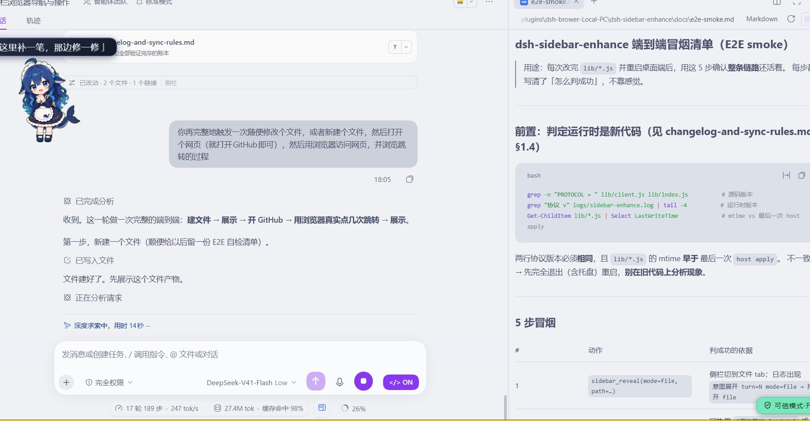
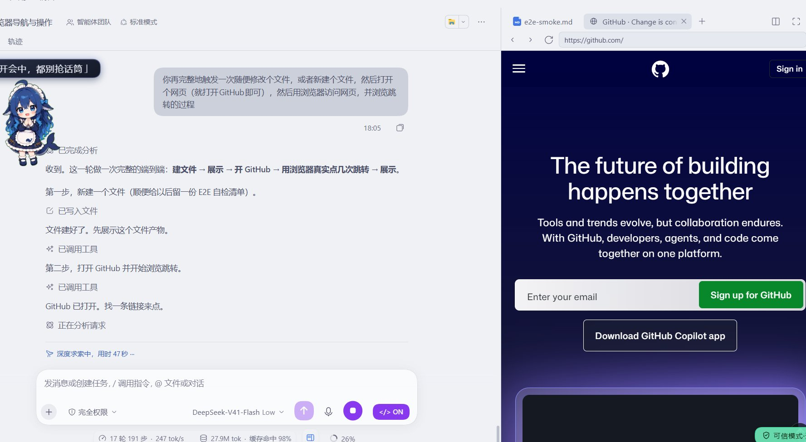
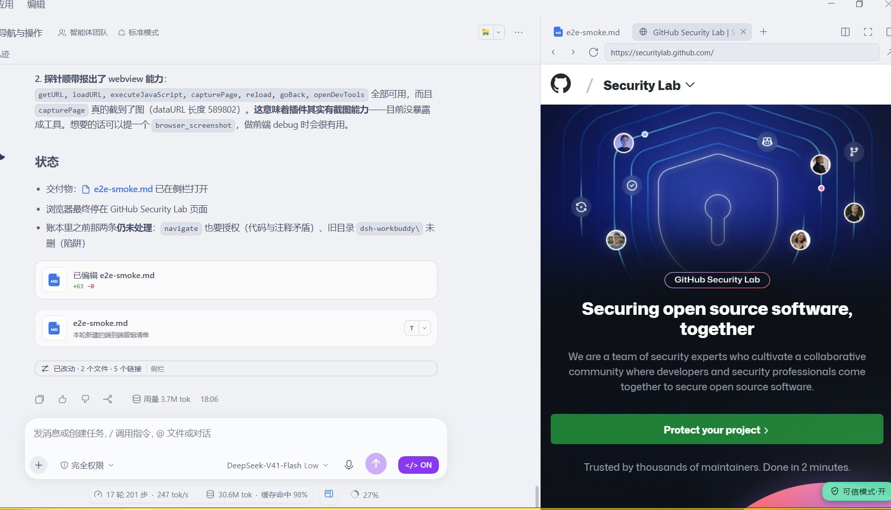
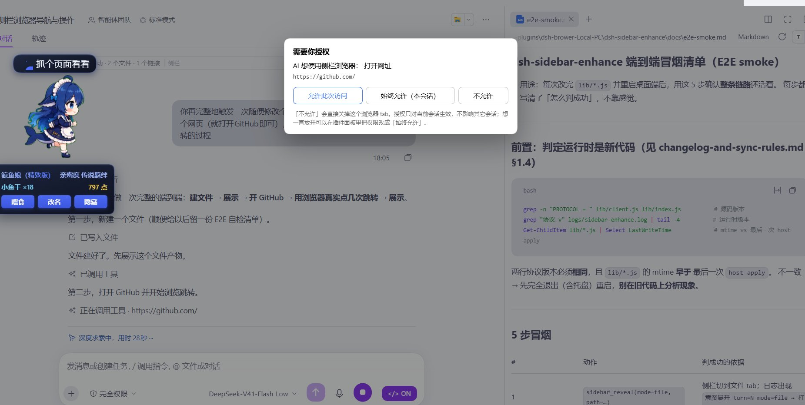

# dsh-sidebar-enhance

> **利用 DSH 官方 API，使 AI 可以直接使用 dsh 侧栏功能自主展示成果文件/网页和进行浏览器搜索获取信息。**

[](https://dsh-plugin.org/plugins/2123043818/dsh-sidebar-enhance)

**能力分类**：工具与能力 ｜ **许可证**：MIT ｜ **依赖**：无外部服务、纯本地

### 版本兼容

| DSH 版本 | 状态 | 说明 |
|---|---|---|
| **桌面端 0.2.0-rc2**（官方） | ✅ **完整支持** | 开发与实测环境：侧栏展示 + 浏览器桥全部功能 |
| **0.1.7-rc2 底**（社区 Linux 套壳） | ✅ 侧栏展示可用 | 社区自建的 Linux 壳实测可正常展开侧栏、展示成果；浏览器桥依赖 Electron `<webview>`，是否可用取决于壳的实现 |
| `dsh web`（网页端） | ⚠️ 部分 | 侧栏展示可用；浏览器桥不可用（没有 `<webview>`） |

> 一句话：**只要 DSH 有那个侧栏，展示功能就能用**；浏览器桥额外要求侧栏浏览器 tab 是 Electron
> `<webview>`。官方目前没有 Linux 版，上表的 0.1.7-rc2 是社区自建套壳的实测结果，非官方支持。

对 DSH 官方客户端**本体侧栏**做两处增强（不新建侧栏、不复制 UI、不碰模型）：

1. **AI 主动展示成果** —— 类似在 AI 即将完成回复时自动打开文件或网页为你展示，
   AI 现在可以主动触发侧栏展开：写完文件、跑起服务、做好网页，侧栏自己打开，不用你去点。
2. **侧栏浏览器交给 AI 用** —— 从「只能人用」变为 AI 可读页面、找元素、点击输入、导航，
   **每一次读写都需要你点头**（三按钮授权），并可借此查资料、跳转、读取网页信息。

> 设计上参考了部分 [dsh-browser-bridge](https://github.com/ycp424c/dsh-browser-bridge) 的思路
> （同样是让 AI 用上侧栏浏览器），实现走的是「宿主注册工具 + 渲染进程执行 DOM」这条路。

> 只做两件事：驱动官方 API 展开侧栏、把侧栏的 `<webview>` 变成 Agent 可操作的浏览器。
> 不新建侧栏、不复制侧栏 UI、不碰模型、不上传任何数据。
> 不新建侧栏、不复制侧栏 UI、不碰模型、不上传任何数据。

---

## 功能展示

### 1. 展示成果（工具 `sidebar_reveal`）

宿主侧注册系统提示词段，要求 Agent 在收尾时调用它。支持：

| mode | 展示什么 | 额外参数 |
|---|---|---|
| `file` | 打开一个具体文件 | `path` |
| `changes` | 本轮改动 diff | — |
| `files` | 工作区文件树 | — |
| `terminal` | 终端 | — |
| `browser` | 网页 | `url` |

插件**不搞「每轮结束自动弹」** —— 那既打扰用户，也会和你刚关掉侧栏的意图打架。


*Agent 写完一份 E2E 自检清单后，侧栏自动展开把文件摆到眼前 —— 不用你自己去点。*

### 2. 浏览器桥（工具 `browser_*`）

侧栏的「浏览器」tab 在桌面端是**真的 Electron `<webview>`**。官方只暴露导航 API，
但 webview 的**元素方法**（`executeJavaScript` / `getURL` / `capturePage`）是 Electron
给 embedder 的能力，插件所在的渲染进程能调到 —— 本插件就是靠这条路把页面交给模型的
（先用只读探针实测确认，再写功能）。

| 工具 | 作用 |
|---|---|
| `browser_navigate` | 导航到某个网址（**已有 tab 时原地跳转**，不会开一堆 tab） |
| `browser_read` | 读当前页面：标题 / URL / 正文 / 链接 / 可交互控件 |
| `browser_find` | 按 CSS 选择器或可见文字找元素，返回可直接喂给 `browser_act` 的路径 |
| `browser_act` | 点击 / 输入 / 选择 / 按键 / 滚动 / 等待 |

**没有截图工具**：官方 AI 侧拿不到附件通道，而且纯文本模型看不了图 ——
观察靠结构化 DOM 更划算。

AI 用 `browser_navigate` 打开网页（左：DSH 对话流；右：侧栏浏览器真实渲染）：



点击链接后**在原 tab 原地跳转**，不打扰你正在看的页面：



### ★ 两组工具都能打开网页 —— 但它们是两条路

| | `sidebar_reveal`（展示） | `browser_navigate` + `read`/`find`/`act`（自己用） |
|---|---|---|
| **一句话** | **把成果摆到用户眼前** | **AI 自己要用这个网页** |
| 谁看 | 用户 | AI（内容返回给模型） |
| 返回内容吗 | **不返回**，打开就够了 | **返回** |
| 典型场景 | 交付：写完了、跑起来了、做好了，让用户自己看 | 查资料、验证刚写的网页渲染得对不对、前端 debug |
| 时机 | 一轮收尾 | 干活中途 |

两者不冲突：先用 `browser_*` 自己调试验证，收尾再用 `sidebar_reveal` 展示。

---

## 安装

**方式一（推荐）：DSH 里直接装**

DSH 桌面端 → **插件 → 添加插件**，填入：

```
https://github.com/2123043818/dsh-sidebar-enhance
```

点安装即可 —— DSH 会从本仓库拉取（若拉取慢/失败，也可以直接填 Release 里的安装包直链）：

```
https://github.com/2123043818/dsh-sidebar-enhance/releases/download/v0.2.0/dsh-sidebar-enhance-0.2.0.tgz
```

**方式二：命令行安装**

```bash
# 桌面端（本插件面向桌面端）
dsh plugin --profile desktop add github:2123043818/dsh-sidebar-enhance

# 网页端 dsh web（同样支持，但侧栏浏览器桥只在桌面端有 webview）
dsh plugin --profile web add github:2123043818/dsh-sidebar-enhance
```

**方式三：从源码装（开发者）**

```bash
git clone https://github.com/2123043818/dsh-sidebar-enhance.git
dsh plugin --profile desktop add link:/absolute/path/to/dsh-sidebar-enhance
```

装好后**完全退出桌面端（含托盘）再启动** —— 刷新页面不够。

> Linux 用户可以照装：官方暂无 Linux 版，社区自建的套壳（0.1.7-rc2 底）实测本插件的侧栏展示功能可用，
> 见上文「版本兼容」。安装命令把 `--profile desktop` 换成你那个壳使用的 profile 名即可。

> 插件分两半：
> - `lib/client.js`（浏览器半侧）：刷新页面 / dev watcher 就会重新加载；
> - `lib/index.js`、`lib/browser.js`（**宿主半侧**）：**只在桌面端进程启动时加载一次**。
>
> 改了宿主半侧只刷新页面，会得到「新 client + 旧 host」且**不报任何异常**。
> 这是本插件最容易踩的坑。

### 卸载

```bash
dsh plugin --profile desktop remove dsh-sidebar-enhance
```

---

## 授权模型（重要）

**导航不需要授权**（那只是打开一个你看得见的页面）；**读页面 / 交互需要**。
需要时插件弹出拦截页，三个按钮：


*AI 想读页面时会先弹这个 —— 三个选择，语义一目了然。*

| 用户选择 | 效果 |
|---|---|
| 允许此次访问 | 本会话 10 分钟内免问 |
| 始终允许（本会话） | 本会话一直免问，**按 SessionId 绑、不影响其它会话、进程重启即失效** |
| 不允许 | 立刻关掉 AI 正在用的那个浏览器 tab |

设置里还有全局策略 `browserPolicy`：`ask`（默认，每次问）/ `allow`（始终允许）。

安全默认值：

- 所有 HTTP 路由**只接受本机回环**来源的请求；
- 授权**不超过进程生命周期** —— 重启即失效，不存在"一次授权永久有效"；
- AI 只能操作**你已经在侧栏打开的那一个页面**；
- 点击默认**在原 tab 跳转**，`target="_blank"` 会被临时拉回 `_self`，
  要新开必须显式 `newTab: true`。

### ⚠️ 使用风险请知悉

把浏览器交给 AI 意味着它能**读到你在那个页面里看到的一切** —— 包括已登录的后台、
私人信息、未发布内容。请仅在你愿意让 AI 看到当前页时授权，
用完关掉那个 tab，或保持设置为 `ask`。

---

## 日志与排障

日志写到 `<插件目录>/logs/sidebar-enhance.log`，也可以在插件面板的「诊断日志」里直接看
（面板还有一行「浏览器桥：在线 · 最近轮询 Ns 前」，通道断没断一眼可见）。

每次启动两半各打一行协议版本，用来确认「加载的是不是最新版」：

```
[host]   host apply: 协议 v10 …
[client] 节点 app · client 协议 v10 …
```

**两行数字必须一致**；不一致就是有一半没重载（通常是没完全退出桌面端）。

---

## 开发

```bash
npm run check   # 语法检查
npm test        # 三套测试（不用起 dsh，在 Node 里造假 window/React 真跑一遍）
npm pack        # 打安装包（产物 dist/dsh-sidebar-enhance-<version>.tgz，发 Release 用）
```

### 发新版本

```bash
# 1. 改 package.json 的 version
# 2. 提交 + 打 tag + 推送
git add -A && git commit -m "release: v0.x.0"
git tag v0.x.0 && git push && git push origin v0.x.0
# 3. npm pack，然后在 GitHub Releases 页面起草新 Release 并上传 dist/*.tgz
npm pack --pack-destination dist
```

结构：

```
lib/index.js      宿主半侧：工具注册、HTTP 路由、系统提示词段
lib/browser.js    宿主半侧：浏览器桥（命令队列、授权存储、四个工具）
lib/client.js     浏览器半侧：UI（徽章 / dock / 拦截页）+ 命令循环 + DOM 操作
cordis.patch.yml  bundle 插入
tests/            smoke / reveal / host 三套
docs/             设计记录与排障文档（含几次真实事故的复盘）
```

`lib/client.js` 是 `__ModuleLoader__.load` 手写 bundle，无构建产物、无 JSX。

---

## 许可证

MIT（见 `LICENSE`）。
